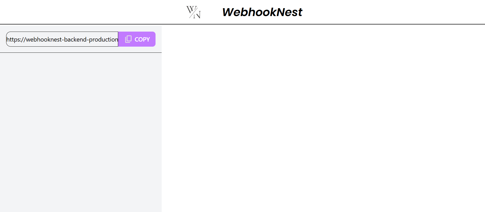
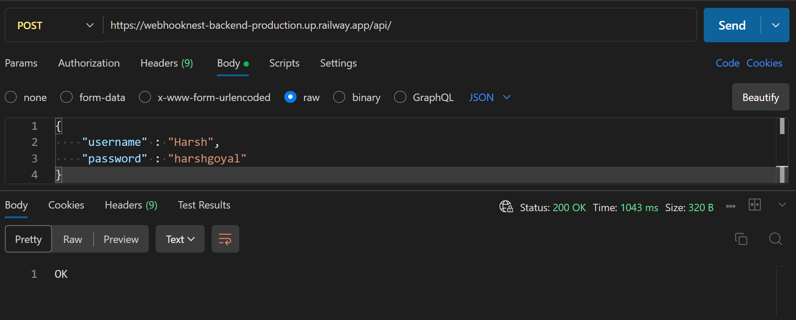
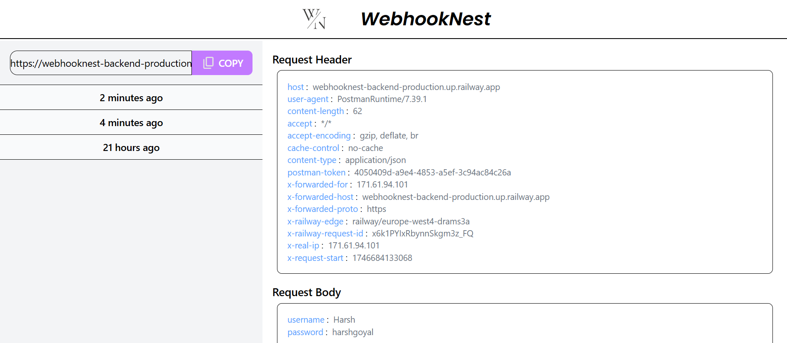

# WebhookNest Frontend

This is the frontend for **WebhookNest**, a RequestBin-like tool that allows developers to capture and inspect incoming HTTP requests.

## Tech Stack

- React (Vite)
- Tailwind CSS
- Framer Motion
- Axios
- Context API

## Features

- Create a new webhook bin (unique URL)
- View incoming request logs
- Split-screen layout for log list + details
- Smooth UI with Framer Motion animations
- Fully responsive layout

## Getting Started

### 1. Clone the repo

```bash
git clone https://github.com/harsh-goyal-004/webhooknest-frontend.git

cd webhooknest-frontend
```

### 2. Install dependencies

```bash
npm install
```

### 3. Start the development server

```
npm run dev
```

### Frontend runs on: http://localhost:5173

## Connecting to Backend

Update the .env file at the root of the frontend:

```
VITE_API_URL=http://localhost:8080/api
```

## Testing Webhook

- Click "Generate your webhook URL"

- Copy the generated POST URL

- Send a POST request using Postman, curl, or another webhook provider:

```bash
curl -X POST http://localhost:8080/api/unique_url \
-H "Content-Type: application/json" \
-d '{"message":"hello"}'

```

- View the request log in the frontend

## Screenshots







## Author

Built with 💻 by Harsh Goyal
